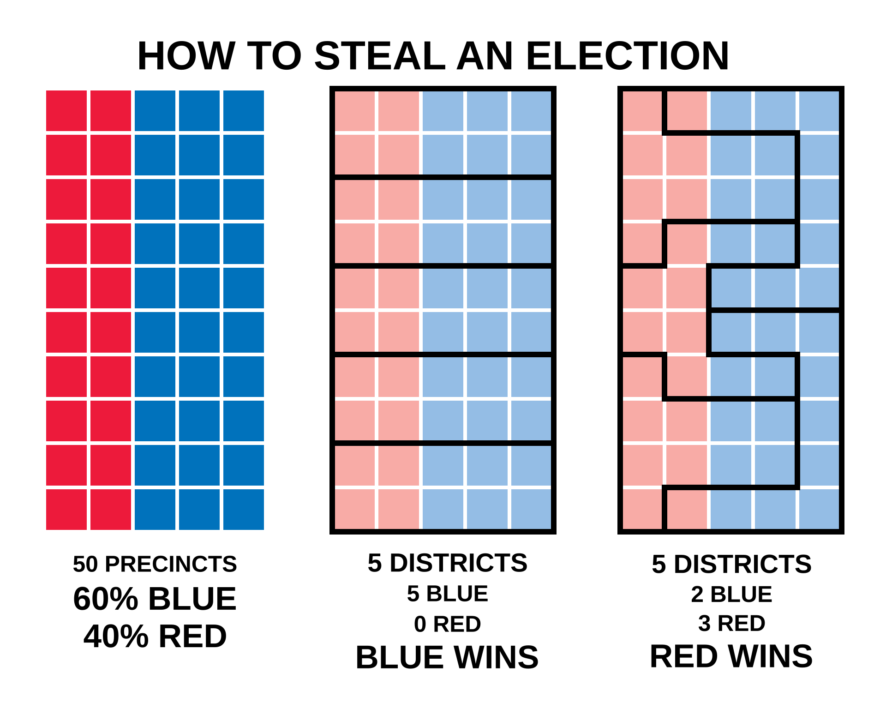

```{r, include=FALSE}
knitr::opts_chunk$set(eval = FALSE)
```

# Learning Objectives

- Working with R to summarize the "typical" value of a variable of various types

- Dealing with task ambiguity 

- Functions: `summary`, `count`, `summarize`, `group_by`, `arrange`

- Question 1: Are female-named hurricanes deadlier? 

- Question 2: How might redistricting affect the 2026 midterms?


# Motivating Claim 1: Hurricanes/Himmicanes

<div class="alert alert-info">
**MOTIVATION QUESTION**
Are female-named hurricanes deadlier than male-named hurricanes?
</div>

In 2014, a research team published a peer-reviewed paper titled ["Female hurricanes are deadlier than male hurricanes"](https://doi.org/10.1073/pnas.1402786111) in a prominent general interest science journal (Jung, Shavitt, Viswanathan, and Hilbe 2014, *Proceedings of the National Academy of Sciences* 111(24): 8782–8787).  Initially, this may seem ridiculous, after all names are assigned by a set procedure. Currently, when wind speeds reach a sustained 39 mph it is assigned the next name on a list used by the World Meteorological Organization. There are six lists with names in alphabetical order that rotate every year. If windspeeds reach 74,ph it becomes a hurricane.  The name of a hurricane that becomes deadly or destructive is retired.   

The argument of the paper was _not_ that the storms differ physically. Instead, researchers claimed that people take a hurricane with a feminine-sounding name less seriously and are less likely to prepare or evacuate and, as a result, more people die.

Even before we start we should have questions about what we are trying to measure and compare.

- What does it mean for female-named hurricanes to be "deadlier"? Deadlier *on average*? Deadlier than a *typical* storm? Are these the same thing?
- Even if suppose someone shows you that the average female-named hurricane killed far more people than the average male-named hurricane would you find that convincing? Why or why not?
- Why might a claim like this get attention?  What does that imply about science?

# Motivating Claim 2: Gerrymanders and the 2026 Midterm

<div class="alert alert-info">
**MOTIVATION QUESTION**
How might redistricting affect the 2026 midterms?
</div>

And now for something completely different (as Monty Python would say). We are heading into the 2026 midterm elections and in a somewhat unprecendented move in recent years -- but not historically (see, for example, my class on Party Politics) -- nine states redrew their congressional district lines after the 2024 presidential election and before the midterm. Some were done by state legislatures, one was approved by a voter referendum, and some were ordered by the courts.

The strategy of gerrymandering is well-known. Consider three ways of assigned the same 50 precincts with the same overall 60/40 split of voters into two very sets of five districts.

{width=85%}
Redistricting is all about how to allocate voters to different districts and how that allocation affects political power and representation. There are all kinds of interesting questions here.
- Which, if any, is "fair"? 
- Suppose someone tells you "the average district barely changed after redistricting." Does that settle whether the lines mattered?
- What *unit* matters here -- the voter, the district, or the state? Does the answer change what you would summarize?

**Background reading:**

If you want some more background on 2026, consider:

- CBS News, [Maps show how Virginia, Texas, California, Missouri, North Carolina and Utah redistricting could affect congressional seats](https://www.cbsnews.com/news/texas-californias-redistricting-maps/). Before-and-after maps for each state.
- Rose Institute of State and Local Government, Claremont McKenna College, [Proposition 50 Backgrounder](https://roseinstitute.cmc.edu/sites/default/files/Proposition%2050%20Backgrounder_101525_1.pdf). Academic explainer on California's redraw.
- Votebeat, [Supreme Court lets Texas keep new congressional map in 2026 midterms](https://www.votebeat.org/texas/2025/12/05/texas-redistricting-ruling-supreme-court-map-2026-midterms/). Nonprofit election-administration newsroom.
- The Texas Tribune, [Texas' new congressional map can be used, Supreme Court rules](https://www.texastribune.org/2026/04/27/texas-redistricting-map-ruling-us-supreme-court-upheld-2026-midterms/).
- SCOTUSblog, [California urges court to permit it to use congressional map enacted to counter Republican gains in Texas](https://www.scotusblog.com/2026/01/california-urges-court-to-permit-it-to-use-congressional-map-enacted-to-counter-republican-gains-in-texas/).

# Univariate Data Analysis

Univariate is pretty much what it sounds like: one variable. When undertaking univariate data analysis, the first task is to figure what type of variable we are working with and, based on that determination, figure out how best to summarize or analyze the variable either as an outcome or as a possible predictor.

These simple characterizations are often essential in our increasingly data-driven society.  Moreover, it is increasingly the case that simple descriptive statistics take on a life of their own and it is impossible to verify where they came from and how truthful they may be.  See, for example this article on ["decorative statistics"](https://www.theatlantic.com/ideas/archive/2023/03/bad-misleading-statistics-false-information-estimates/673359/) - also in Course Dropbox.

## What is "typical"?

A question that you will almost surely be asked to answer in whatever you do as a data scientist is to characterize the data and determine what the "average/typical" value is.  

- For example, how competitive is the typical/average/normal congressional district in the United States?
- What percentage of votes is a Republican candidate likely to receive in a district?
- How many districts typically support Democrats running for president?

Here is where things get tricky -- we often use the word ``average" when referring to a "typical" or "normal" value, but the mathematical definition of an average may not be what we actually mean! The word "average" is often used when people actually mean "typical" and your task as a data scientist is to figure out how best to determine what it means to be "typical!"

This is sometimes easier said than done.  Possible choices for defining what it means to be typical include:

 * The value that is most likely to appear in the data (i.e., `mode`).
 
 * The value that is in the middle of the data after we sort the data from the smallest to the largest -- assuming that the data can be meaningfully sorted! (i.e., `median`).  All that matters here is the order of the values.
 
 * The value that reflects the average value of the observations (i.e., `mean`).  All that matters here is the values themselves.

The formula for calculating the sample mean (\( \bar{x} \)) is given by:

\[ \bar{x} = \frac{1}{n} \sum_{i=1}^{n} x_i \]

Where:

 *  \( \bar{x} \) represents the sample mean.

 *  \( n \) is the number of observations in the sample.

 *  \( x_i \) represents each individual observation in the sample.

Something that is true of data science is that you are often asked to answer questions that are not well defined.  As a result, one of the first tasks you have to do is to figure out what someone wants to know (i.e., what you are being asked to do), figure out what you can do with the available data, and consider the possible slippage between what you can say and what you are being asked to say!

Let's get the data on hurricanes and, as always, `glimpse` it to see what we are working with.

```{r, message = FALSE}
library(tidyverse)
hurr = read.csv("hurricanes.csv")
glimpse(hurr)
```

<!-- Data credit — carry into any slide or assignment that uses this data:
     DAAG::hurricNamed (Maindonald & Braun, GPL-3), adapted from Jung et al.
     (2014, PNAS), https://doi.org/10.1073/pnas.1402786111 . Published critique
     and reply: https://doi.org/10.1073/pnas.1410910111 . -->

Each row is a named U.S. hurricane that made landfall between 1950 and 2012.

| Name | Definition |
|---|---:|
| rownames | Storm identifier, name plus year |
| Name | Storm name |
| Year | Year of landfall |
| mf | Name gender: `f` female, `m` male |
| deaths | Number of deaths in the United States |
| firstLF | Date of first landfall |
| BaseDam2014 | Property damage in millions of 2014 dollars |

Of primary interest is in how the number of people killed (`deaths`) varies based on whether the storm is named female (`"f"`) or male (`"m"`) -- `mf`.

## Starting with a `summary`

The `summary` function is a powerful tool.  It will report -- for any numeric (i.e., integer or double). variable -- the minimum value, the maximum value, and the sample mean as defined above.  It will also report the 25th, 50th and 75th quantiles of the data -- values it finds by arranging the data from smallest to largest and then finding the value that corresponds to the 25th percentile, the 50th percentile and the 75th percentile.  Note that the 50th percentile is the same as the median.

In other words, the `summary` function gives us both the `mean` and the `median` for every variable, as well as some idea of how much the variable varies by reporting the range of the variable -- i.e., the minimum and maximum value -- and also the values of the 25th and 75th percentiles.  We will talk about measures of variation later, but for now we are going to focus on the measures of `mean` and `median`.

One way to use the `summary` function is to apply it to the entire dataset.  This will summarize every numeric variable.

```{r, eval = FALSE}
summary(hurr)
```

We can also apply `summary` to a single (or a subset of variables) using the `select` function.  If we wanted to consider the amount of damage in 2014 dollars we can use:

```{r}
hurr |>
  select(BaseDam2014) |>
  summary()
```

NOTE: If we wanted to use a non-tidyverse code, we could also use the ability to reference variables within a datafame using `$` 

```{r, eval = FALSE}
summary(hurr$BaseDam2014)
```

So, how deadly is the "typical" hurricane? Well, it depends on what we mean by `typical'. We have a continuous variatible (`deaths') so we can compute the median or mean.

```{r}
hurr |>
  summarize(mean_deaths   = mean(deaths, na.rm = TRUE),
            median_deaths = median(deaths, na.rm = TRUE))
```

The mean is very different than the median. What does that mean?

```{r}
hurr |>
  arrange(desc(deaths)) |>
  select(Name, Year, mf, deaths) |>
  head(10)
```

There are a few catastrophic storms, with deaths in the hundreds or thousands, and many more with much fewer. The "average" hurricane death toll computed using the `mean` is barely describing a typical storm at all because it reflects the impact of a few very high impact storms!

## Does the claim hold up?

Lets return to the claim that "female hurricanes are deadlier." This is a claim about a grouped central tendency. So let's compute it using both the `mean` and the `median` using the `group_by` function.  `group_by(mf)` tells R to split the data into one group per value of `mf` -- here `f` and `m` -- so that the `summarize` that follows is computed separately for each group and returns one row per group rather than a single number.  We will use it a lot more later today.

```{r}
hurr |>
  group_by(mf) |>
  summarize(n = n(),
            mean_deaths   = mean(deaths),
            median_deaths = median(deaths))
```

Taken at face value, the means support the claim. But look at the medians. What do you observe? Is the typical female-named storm actually deadlier than the typical male-named storm?

NOTE: There are many more female-named than male-named storms because U.S. hurricanes were initially given only female names. Male names did not enter the rotation until 1979.^[Three male-named storms predate 1979 in these data — King (1950), Able (1952), and Ione (1955) — artifacts of early naming conventions before the modern alternating system. They are too few and too small to affect the comparison.]

We can see if this matters by looking at the results when both kinds of names were used — i.e., from 1979 onward — using `filter`.

```{r}
hurr |>
  filter(Year >= 1979) |>
  group_by(mf) |>
  summarize(n = n(),
            mean_deaths   = mean(deaths),
            median_deaths = median(deaths))
```

If anything, the effect only increases!

BOTTOM LINE: A real, peer-reviewed claim, summarized with a mean, looked convincing; the same data summarized with a median told a different and more honest story. The mean is easy to explain and it is what most people reach for — and it is exactly the wrong summary when a few extreme cases can dominate it.

NOTE: Our work is *not* a reproduction of the published paper. Jung et al. deliberately set Katrina and Audrey aside as outliers and fit a statistical model using how feminine each name was (using tools we will learn later). Even so, we *have* shown that the headline depends on a couple of storms. If interested, the paper drew a formal published critique and a reply from the authors, both linked below.

## A Second Motivating Question: Redistricting and the 2026 midterms

Today we'll be working with the 2024 presidential election results for each of the 435 congressional districts and see what that implies about the 2026 midterms.  As you may know, several states redrew their congressional district lines after 2024 and we may be interested in how that affects expectations about what may happen.

To start, how would we use this to evaluate the impact of redistricting?

Let's start by loading in the data:

```{r, message = FALSE}
cd = read.csv("cd2026_by_presvote.csv")
```

As with all of our projects we want to start by getting a sense of the data.  We like to `glimpse` at the data to get a sense of what the first observations look like for each variable.

```{r}
glimpse(cd)
```

This dataset contains the following variables. Variables ending in `_2024map` use the district lines from the 2024 election; variables ending in `_2026map` use the district lines for the 2026 election.  Both measure the *same* 2024 presidential vote so any difference is a result of a redistricting.

# Codebook

| Name               |                          Definition |
|--------------------|------------------------------------:|
| district         |      District label, e.g., `TN-07` (`AL` = at-large) |
| state           |      State postal abbreviation |
| cd         |   District number within the state (99 = at-large) |
| member         |   U.S. House member (as of the 2024 election) |
| party           |   Party of the House member (D, R) |
| harris_pct_2024map, harris_pct_2026map           |   Percent of the 2024 presidential vote for Harris |
| trump_pct_2024map, trump_pct_2026map           |   Percent of the 2024 presidential vote for Trump |
| dem_margin_2024map, dem_margin_2026map  | Harris percent minus Trump percent (positive = Harris won the district) |
| redistricted  | Were the district's lines redrawn for 2026? 1 = yes, 0 = no |

We can look at so many questions, but today we are going to look at:

-   How competitive is the typical congressional district?
-   Which districts are competitive and which are lopsided?
-   What did redistricting do?

We start out by doing the same type of wrangling that we have always done. The goal is to examine some cases to figure out what kind of variable it is and decide how to summarize that variable in an appropriate manner.

As we go make note of how much ambiguity and discretion there is in what we are doing.  As I have repeatedly emphasized, analyzing data requires making an argument about how to measure, analyze and interpret the patterns we find in available data.  When we use data to answer a question, our answer is only as good as the arguments we can make to justify the consequential choices we are making.  

For example, what does it mean to ``be competitive"?  Does that mean the margin in vote share between candidates is close to being tied?  Within two percentage points?  Five? Ten?  Or does competition mean the fraction of districts won by each candidate -- regardless of the margin?  

Consider, for example, if one party won every single district 50.05 \% to 49.95 \%.  The overall popular vote margin would be very small -- 0.1\% -- but one party would have won every district! (Keep this possibility in mind as it is exactly the logic that redistricting exploits.)

## Continuous

Let's start by taking a look at `dem_margin_2024map` -- Harris's percent minus Trump's percent in each district. It seems pretty likely that this is a continuous variable. Let's take a look at the 10 most Democratic districts in the United States by using the ``arrange` function that we are going to look at in `desc`ending order, and then print the top 10 using `head`. (There are lots of ways to do this -- this is just a fancy way.)

```{r}
cd |> 
  select(district, member, party, dem_margin_2024map) |> 
  arrange(desc(dem_margin_2024map)) |> 
  head(10) 
```

What do you observe about them?  Where are they?

*Quick Exercise* Do the same thing for the 10 most Republican districts.  How do they compare to the 10 most Democratic districts?

```{r}
# INSERT CODE HERE
```

## Measures for Continuous Variables

The mean is used most of the time for continuous variables, but as we have seen, it can be VERY sensitive to outliers. The median (50th percentile) is usually better, but it can be difficult to explain to general audiences. 

```{r}
cd |>
  summarize(mean_margin = mean(dem_margin_2024map),
            median_margin = median(dem_margin_2024map))
```

So the *average* district was essentially tied, but the *median* district favored Trump by about 3 points.  Which is the "typical" district?

Why do they differ?  Look back at the 10 most Democratic districts: the most lopsided districts in the country are Democratic ones, -- just like the most catastrophic hurricanes had female names.

*Quick Exercise* Determine the typical value of `harris_pct_2024map`. What measure would you prefer? Calculate that measure.  

```{r}
# INSERT CODE HERE
``` 

This is the typical district in the whole country.  What if we wanted to see how the typical district varied by state?

One possibility is to filter by state.

```{r}
cd |>
  filter(state == "TN") |>
  summarize(mean_margin = mean(dem_margin_2024map),
            median_margin = median(dem_margin_2024map))
``` 

But this is a pain -- and it requires repeating code 50 times.  Better if we could tell R to group the data and then `summarize` the results for each group.  But this is the `group_by` function!

```{r}
cd |>
  group_by(state) |>
  summarize(n_districts = n(),
            mean_margin = mean(dem_margin_2024map),
            median_margin = median(dem_margin_2024map))
``` 

Pretty cool!  Now instead of summarizing to a single value that is the average across all 435 districts, we are calculating the average separately for each state!  So instead of producing a single value, we now have a tibble where the first column denotes the `state` and the remaining columns contain the number of districts and the calculated mean and median.

*Quick Exercise* Which states have the biggest gap between the mean and median district? This requires tweaking the code to add a `mutate` -- would you add that before or after the `summarize`? What does that tell you?

```{r}
# INSERT CODE HERE
``` 

BOTTOM LINE: With a continuous variable either the `mean` or `median` make the most sense.  The `mean` is easier to explain to others, but it is sensitive to outliers. 


## Categorical: ordered

How competitive is a district? Although margin is a continuous variable, analysts and campaigns usually talk about categories od districts: toss-up, lean, likely, safe.  We can create that ordered categorical variable ourselves with `case_when` using the size of the margin regardless of who won -- `abs` gives the absolute value.

```{r}
cd = cd |>
  mutate(competitive_2024map = case_when(
    abs(dem_margin_2024map) < 5 ~ "Toss-up (<5)",
    abs(dem_margin_2024map) < 10 ~ "Lean (5-10)",
    abs(dem_margin_2024map) < 20 ~ "Likely (10-20)",
    abs(dem_margin_2024map) >= 20 ~ "Safe (20+)"))

cd |>
  count(competitive_2024map)
```

See how it collapses a continuous variable into a small set of possible categories? This is an _ordered categorical_ variable. To summarize, we  should calculate the proportions in each category to determine which category is most likely to appear (i.e., the `mode`).  (To change into percentages we can multiply by 100.)

```{r}
cd |>
  count(competitive_2024map) |>
  mutate(Pct = 100*n/sum(n))
```

More than half of districts are safe for one party and only about 1 in 10 is a toss-up.  Note that if we had coded the categories as numbers (1, 2, 3, 4) `R` would happily compute a mean, but the categories are not really meaningful -- why is something a `2` rather than a `4`?  We assigned values to categories to denote order, but the scale of those numeric differences is not at all meaningful. (Technically speaking, they are ordinal rather than cardinal values.)

BOTTOM LINE: Tricky! If you have an ordered categorical variable, either the `mode` or the` median` almost always makes sense.  However, sometimes the `mean` is also often used -- e.g., in our exit poll analysis we took the average opinion about the importance of racism in the country despite the variable being an ordered categorical variable.  This highlights the importance of always thinking about what you are trying to measure and making an argument about why the measure is appropriate!

## Categorical: unordered

Let's take a look at the state, which is a good example of an _unordered categorical_ variable.  

```{r}
cd |>
  count(state) |>
  arrange(desc(n)) |>
  head(10)
```

Taking a mean or a median doesn't make any sense here.  Using `count`, however, we can determine the most frequent value -- i.e., the mode -- and that helps describe the measure.

Note that while our variable is a string, these can also be coded as integer or numeric valued. Like ordered categorical variables, performing mathematical operations on these variables is meaningless. In fact, while the average of a ordered categorical variable may be marginally informative about whether the distribution of values is closer to the maximum or minimum value -- a finding that may have some substantive importance given the meaning of the ordering -- there is no such interpretation for unordered categorical variables.  Here the results of such an analysis would be nonsensical.

BOTTOM LINE: If you have an unordered categorical variable -- using the `count` or mode to summarize the variable often makes the most sense.

## Categorical: Binary

Let's take a look at the variable for whether a district was redrawn. We can always start with a `count` to see the distribution of values:

```{r}
cd |> 
  count(redistricted)
```

But because it is coded 0,1 we can calculate the `mean` to give us the proportion of districts that were redrawn. If we multiply that by 100 we can get the percentage. 

```{r}
cd |> 
  summarize(PctRedistricted = 100*mean(redistricted))
```

So nearly a third of all congressional districts had their lines changed between 2024 and 2026.

We can also create a binary variable ourselves.  Did Harris win the district?  Using `if_else` as we did in Session 3:

```{r}
cd = cd |>
  mutate(harris_won_2024map = if_else(dem_margin_2024map > 0, 1, 0),
         harris_won_2026map = if_else(dem_margin_2026map > 0, 1, 0))

cd |>
  summarize(HarrisDistricts = sum(harris_won_2024map),
            PctHarris = 100*mean(harris_won_2024map))
```

Harris carried 204 of the 435 districts -- 46.9\% -- while losing the national popular vote by about 1.5 percentage points.

BOTTOM LINE: If you have an categorical binary variable that is recoded to be "0" or "1" then using the `mean` will report the proportion of 1's in the variable.

## Analysis: What is the unit of analysis?

How competitive was the 2024 presidential election?  Our mean district margin was essentially 0, but Trump won the national popular vote by about 1.5 percentage points (49.8\% to 48.3\%).  Why the difference?

The first question we always want to ask is -- what is the unit of analysis?  Here it is the district, and every district counts equally in the mean.  Districts have roughly equal *populations*, but they do not have equal *turnout*, and we are averaging percentages rather than adding up votes.  So the average district is close to -- but not the same as -- the national result.  

## Analysis: What did redistricting do?

So what did redistricting do? The `_2026map` variables contain the *same* 2024 votes tallied using the new district lines.  Let's see what happened to the typical district?  (Below, `old` refers to the 2024 lines and `new` to the 2026 lines; `seats` counts the districts Harris carried.)

```{r}
cd |>
  summarize(mean_old = mean(dem_margin_2024map),
            mean_new = mean(dem_margin_2026map),
            median_old = median(dem_margin_2024map),
            median_new = median(dem_margin_2026map),
            seats_old = sum(harris_won_2024map),
            seats_new = sum(harris_won_2026map))
```

The mean barely moves.  It cannot: the same votes are being added up, just in different piles.  But the median moves, and the number of districts Harris carried drops from 204 to 201.

To see how, `group_by` state.  Because `redistricted` is 0/1, `sum(redistricted)` counts the redrawn districts in each state, and we can `filter` on that count *after* summarizing to keep only the states that changed something.

```{r}
cd |>
  group_by(state) |>
  summarize(n_redrawn = sum(redistricted),
            mean_old = mean(dem_margin_2024map),
            mean_new = mean(dem_margin_2026map),
            median_old = median(dem_margin_2024map),
            median_new = median(dem_margin_2026map),
            seats_old = sum(harris_won_2024map),
            seats_new = sum(harris_won_2026map)) |>
  filter(n_redrawn > 0)
```

Two states to focus on.  In Texas the mean and the median are essentially unchanged, yet the number of Harris districts falls from 11 to 8.  In California the mean is unchanged and the median *falls* by more than 7 points -- and yet the number of Harris districts *rises* from 41 to 47.  How can the typical district move toward Republicans while Democrats win more of them?

Redistricting works by changing the *distribution* of votes across districts without changing the total.  The two tools are:

- **Packing**: concentrate the other party's voters into a few districts they win overwhelmingly, "wasting" their votes.
- **Cracking**: spread the other party's voters across several districts where they fall just short.

Let's look at Texas district-by-district, sorted by the old margin.

```{r}
cd |>
  filter(state == "TX") |>
  select(district, party, dem_margin_2024map, dem_margin_2026map) |>
  arrange(dem_margin_2024map)
```

Find the districts where the sign flips: TX-09, TX-32, and TX-35 went from Harris by 24 to 44 points to Trump by 10 to 20 points (cracked).  Now find TX-18 and TX-37, which went from Harris +40 and +49 to Harris +55 and +57 (packed).  The Democratic votes did not disappear; they were moved from districts where they produced a win into districts that were already won.

Now California, where the tools were used in the other direction: the safest Democratic districts were *unpacked* -- CA-02 went from Harris +45 to +25, CA-04 from +31 to +15 -- and those voters were used to flip CA-01, CA-41 and CA-48 from Trump districts into Harris districts.  Spreading your own voters more thinly makes the median district less Democratic, but it wins more seats.  That is exactly the 50.05 to 49.95 logic from the start of class.

*Quick Exercise* Do the same district-by-district look for Florida.  Which districts were cracked?  Which were packed?

```{r}
# INSERT CODE HERE
```

*Quick Exercise* Redo the competitiveness categories using `dem_margin_2026map`. Did redistricting make districts more or less competitive?

```{r}
# INSERT CODE HERE
```

So which summary tells you what redistricting did?  Not the mean.  The median and the count of districts above zero do.  A single "average" would have told you nothing happened.

# Differences in Percentages or Percent Difference?

Under the 2024 lines there were 44 toss-up districts; under the 2026 lines there are 37.  As a share of the 435 districts that is 10.1\% and 8.5\%.  So how much less competitive did the House become?

Since these are percentages -- 10.1\% and 8.5\% -- one measure is simply the *percentage point difference*:

```{r}
8.5 - 10.1
```

...so a 1.6 percentage point decline.

\[ \mbox{Percentage Point Change:} X_{new} \% - X_{old} \% \]

But we could also discuss this in terms of *percent change* -- that is how much the value differs from a baseline value.  Instead of subtracting percentages, this involves division to compare the size of the value relative to a baseline -- here the number of toss-ups under the old lines.

```{r}
100*(37 - 44)/44
```

So the number of toss-up districts declined by about 16\%.

\[ \mbox{Percent Change:} 100 \times \frac{X_{new} - X_{old}}{X_{old}} \% \]

Note how differently those numbers seem, even though they describe the same change -- a 1.6 percentage point decline seems small, but a 16\% decline seems large.  This is where understanding how humans comprehend numbers becomes important!

<div style="text-align:center">
**ALWAYS THINK ABOUT WHAT YOU ARE DOING!**
</div>

While it is very easy to feel overwhelmed by the coding and the sea of numbers, so much of what we do actually involves critical thinking and being mindful of exactly what we are measuring!  Both of the answers are "correct" in terms of using code to extract numbers.

# A Counterfactual: Turning Vote Shifts into Seats

The 2024 map and the 2026 map hold the same votes, so the comparison so far only tells us what the lines did to the *2024* result.  But elections change.  What if the 2026 electorate shifts 4 points toward Democrats relative to 2024 -- a typical midterm swing against the president's party?

The simplest assumption is a *uniform swing*: every district moves by the same amount.  That is just adding 4 to every margin with `mutate`, then counting the districts above zero -- once for each set of lines.  (A majority of the House is 218 seats.)

```{r}
cd |>
  mutate(harris_won_old_shift4 = if_else(dem_margin_2024map + 4 > 0, 1, 0),
         harris_won_new_shift4 = if_else(dem_margin_2026map + 4 > 0, 1, 0)) |>
  summarize(seats_old = sum(harris_won_2024map),
            seats_old_shift4 = sum(harris_won_old_shift4),
            seats_new = sum(harris_won_2026map),
            seats_new_shift4 = sum(harris_won_new_shift4))
```

The same 4-point shift wins a House majority under the old lines (221 seats) but falls short under the new lines (215).  Redistricting did not just move 4 seats in 2024; it changed how many seats a given swing in the vote produces.

Where did the swing go?  `group_by` state again.

```{r}
cd |>
  mutate(harris_won_old_shift4 = if_else(dem_margin_2024map + 4 > 0, 1, 0),
         harris_won_new_shift4 = if_else(dem_margin_2026map + 4 > 0, 1, 0)) |>
  group_by(state) |>
  summarize(n_redrawn = sum(redistricted),
            seats_old = sum(harris_won_2024map),
            seats_old_shift4 = sum(harris_won_old_shift4),
            seats_new = sum(harris_won_2026map),
            seats_new_shift4 = sum(harris_won_new_shift4)) |>
  filter(n_redrawn > 0)
```

In Texas and Florida a 4-point Democratic swing changes *nothing* under the new lines.  That is what cracking and packing look like from the other side: the cracked districts were built with enough of a cushion that a normal swing does not flip them back.  Look back at the Texas listing: the three flipped districts (TX-09, TX-32, TX-35) were drawn at Trump +10 to +20, beyond the reach of a 4-point swing, and the margin to do that came out of districts that had been Trump +35 to +45 and are now Trump +25.

What about a much bigger swing -- say 13 points, a genuine wave?  Same code, different number.

```{r}
cd = cd |>
  mutate(harris_won_old_shift13 = if_else(dem_margin_2024map + 13 > 0, 1, 0),
         harris_won_new_shift13 = if_else(dem_margin_2026map + 13 > 0, 1, 0))

cd |>
  summarize(seats_old_shift13 = sum(harris_won_old_shift13),
            seats_new_shift13 = sum(harris_won_new_shift13))

cd |>
  group_by(state) |>
  summarize(n_redrawn = sum(redistricted),
            seats_new = sum(harris_won_2026map),
            seats_new_shift4 = sum(if_else(dem_margin_2026map + 4 > 0, 1, 0)),
            seats_new_shift13 = sum(harris_won_new_shift13)) |>
  filter(n_redrawn > 0)
```

Now the cushions give way.  Under the new lines Texas goes from 8 Harris districts to 11 and Florida from 4 to 9 -- the cracked districts were drawn at Trump +10 to +20, safe against a 4-point swing but not a 13-point one.  A map built to withstand a normal election can hand over a pile of seats in a wave, because cracking means spreading your own voters thin.  The mean and median never told us any of this; it took counting districts above a moving line.

*Quick Exercise* What happens with a 4-point shift toward Republicans?  With a 2-point shift toward Democrats?  How big a Democratic swing is needed to reach 218 under the new lines?

```{r}
# INSERT CODE HERE
```

One caution: a uniform swing is an assumption, not a fact.  Real swings vary across districts, and we will build tools to think about that kind of uncertainty next session.

# New R Functions Introduced in Lecture 5

Functions introduced in Lectures 2–4 are intentionally omitted.

| Function | What it does |
|---|---|
| `arrange()` | Sorts rows by a variable, smallest to largest. |
| `desc()` | Reverses the ordering of a variable inside `arrange()`. |
| `seq()` | Creates a sequence of equally spaced values. |
| `length()` | Counts the number of values in a vector. |
| `abs()` | Returns the absolute value of a number. |

# Works Cited

## Data

The Downballot. 2025. "It's Here: The Downballot's 2024 Presidential Results
for All 435 House Districts."
[https://www.the-downballot.com/p/its-here-the-downballots-2024-presidential](https://www.the-downballot.com/p/its-here-the-downballots-2024-presidential).

## Images

Nass, Steven. "How to Steal an Election - Gerrymandering." Wikimedia Commons,
CC BY-SA 4.0.
[https://commons.wikimedia.org/wiki/File:How_to_Steal_an_Election_-_Gerrymandering.svg](https://commons.wikimedia.org/wiki/File:How_to_Steal_an_Election_-_Gerrymandering.svg).
The course file `images/gerrymandering_nass.png` is a PNG rendering of the
original SVG.

## Writings

Abbott v. League of United Latin American Citizens, No. 25A608 (U.S. Dec. 4,
2025) (order granting stay). Legal Information Institute, Cornell Law School.
[https://www.law.cornell.edu/supremecourt/text/25A608](https://www.law.cornell.edu/supremecourt/text/25A608).

Brown, Nicholas J. L., and James A. J. Heathers. 2017. “The GRIM Test: A Simple
Technique Detects Numerous Anomalies in the Reporting of Results in Psychology.”
*Social Psychological and Personality Science* 8(4): 363–369.
[https://doi.org/10.1177/1948550616673876](https://doi.org/10.1177/1948550616673876).

CBS News. 2025. "Maps Show How Virginia, Texas, California, Missouri, North
Carolina and Utah Redistricting Could Affect Congressional Seats."
[https://www.cbsnews.com/news/texas-californias-redistricting-maps/](https://www.cbsnews.com/news/texas-californias-redistricting-maps/).

Christensen, B., and S. Christensen. 2014. “Are Female Hurricanes Really
Deadlier than Male Hurricanes?” *Proceedings of the National Academy of
Sciences* 111(34): E3497–E3498.
[https://doi.org/10.1073/pnas.1410910111](https://doi.org/10.1073/pnas.1410910111).

Fisman, Ray, Andrew Gelman, and Matthew C. Stephenson. 2023. “The Statistics
That Come Out of Nowhere.” *The Atlantic*, March 12.
[https://www.theatlantic.com/ideas/archive/2023/03/bad-misleading-statistics-false-information-estimates/673359/](https://www.theatlantic.com/ideas/archive/2023/03/bad-misleading-statistics-false-information-estimates/673359/).

Howe, Amy. 2026. "California Urges Court to Permit It to Use Congressional Map
Enacted to Counter Republican Gains in Texas." *SCOTUSblog*, January.
[https://www.scotusblog.com/2026/01/california-urges-court-to-permit-it-to-use-congressional-map-enacted-to-counter-republican-gains-in-texas/](https://www.scotusblog.com/2026/01/california-urges-court-to-permit-it-to-use-congressional-map-enacted-to-counter-republican-gains-in-texas/).

Jung, Kiju, Sharon Shavitt, Madhu Viswanathan, and Joseph M. Hilbe. 2014.
“Female Hurricanes Are Deadlier than Male Hurricanes.” *Proceedings of the
National Academy of Sciences* 111(24): 8782–8787.
[https://doi.org/10.1073/pnas.1402786111](https://doi.org/10.1073/pnas.1402786111).

Jung, Kiju, Sharon Shavitt, Madhu Viswanathan, and Joseph M. Hilbe. 2014. “Reply
to Christensen and Christensen and to Malter: Pitfalls of Erroneous Analyses of
Hurricane Names.” *Proceedings of the National Academy of Sciences* 111(34):
E3499–E3500.
[https://doi.org/10.1073/pnas.1411652111](https://doi.org/10.1073/pnas.1411652111).

Rose Institute of State and Local Government. 2025. "Proposition 50
Backgrounder." Claremont McKenna College, October 15.
[https://roseinstitute.cmc.edu/sites/default/files/Proposition%2050%20Backgrounder_101525_1.pdf](https://roseinstitute.cmc.edu/sites/default/files/Proposition%2050%20Backgrounder_101525_1.pdf).

The Texas Tribune. 2026. "Texas' New Congressional Map Can Be Used, Supreme
Court Rules." April 27.
[https://www.texastribune.org/2026/04/27/texas-redistricting-map-ruling-us-supreme-court-upheld-2026-midterms/](https://www.texastribune.org/2026/04/27/texas-redistricting-map-ruling-us-supreme-court-upheld-2026-midterms/).

Votebeat. 2025. "Supreme Court Lets Texas Keep New Congressional Map in 2026
Midterms." December 5.
[https://www.votebeat.org/texas/2025/12/05/texas-redistricting-ruling-supreme-court-map-2026-midterms/](https://www.votebeat.org/texas/2025/12/05/texas-redistricting-ruling-supreme-court-map-2026-midterms/).

Malter, Daniel. 2014. “Female Hurricanes Are Not Deadlier than Male Hurricanes.”
*Proceedings of the National Academy of Sciences* 111(34): E3496.
[https://doi.org/10.1073/pnas.1411428111](https://doi.org/10.1073/pnas.1411428111).
