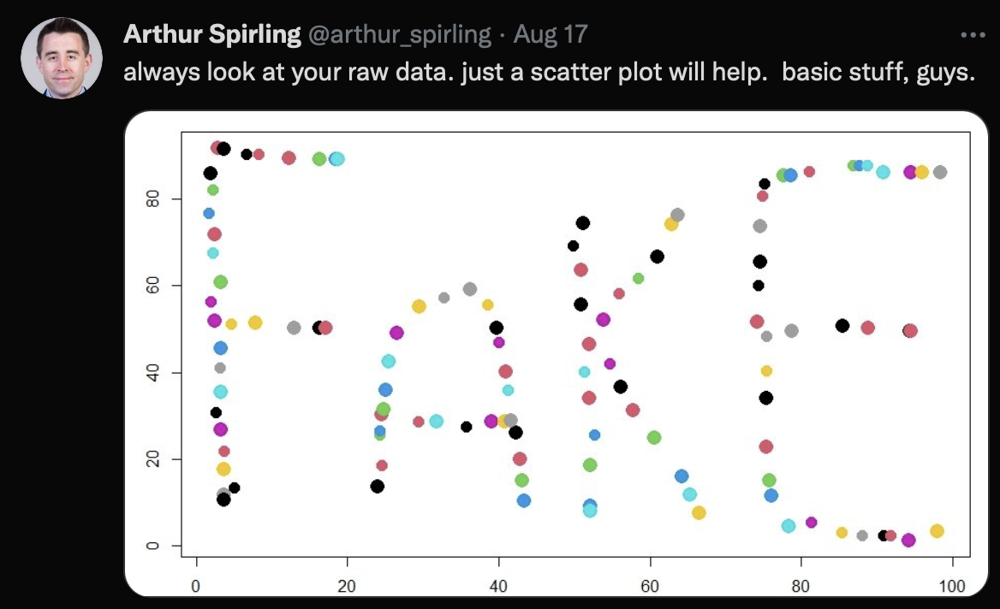
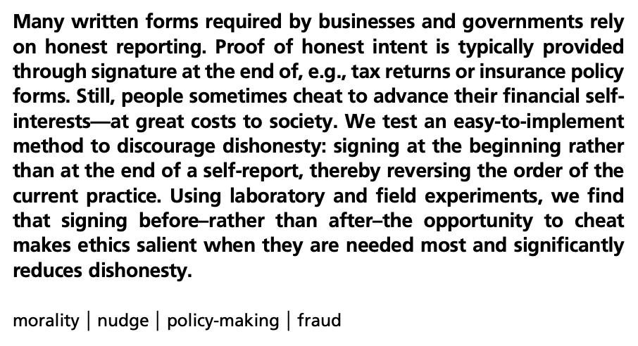
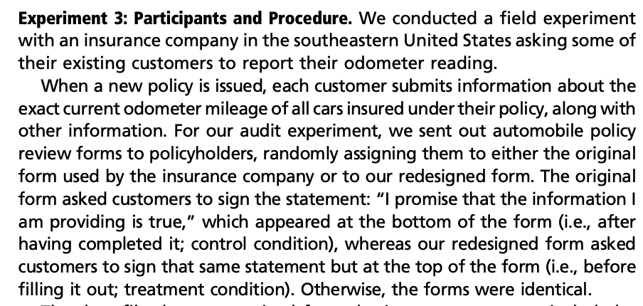
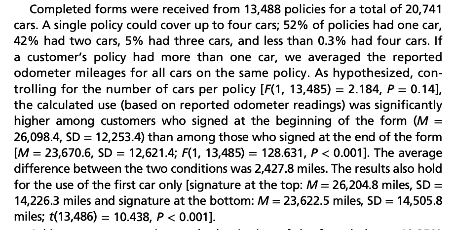

```{r setup, include=FALSE}
knitr::opts_chunk$set(eval = FALSE, echo = TRUE, message = FALSE, warning = FALSE)
```

# Today's Agenda: Learning Objectives

Summarizing Univariate (Single) Relationship using Bargraphs, Histograms, and Densities in the glorious world of `ggplot`. The so-called "Grammar of Graphics".

- `ggplot` basics.

- Plot types: `geom_bar`, `geom_histogram`, `geom_density`

- Plot aesthetics: `labs`, `scale_x_continuous`, `geom_vline`, `theme_bw`

# Motivation: Communicating Data is Essential

- As we talked about before, data does not exist in a vacuum -- it is always interpreted in relationship to something.

- Moreover, all data-science should be question driven! What is the question you are asking? 

- What is the answer that your visualization is providing?

- Does your visualization communicate the relationship cleanly and accurately?

- Humans infer causality (much too quickly!).

These are the foundational premises that driven our data visualization.

# Visualization using `ggplot`

- _Everything_ in an R visualization can be controlled.

- Graphs themselves are an object that can be saved and altered.

- Step 1: Start with the question you want the visualization to answer.

- Step 2: Create a blank "canvass" and add graphical elements using the "grammar of graphics."

- Step 3: Assess whether the visualizing clearly and accurately provides the right answer to the question you are asking. Revise if not.

## Visualization First Steps

Our first graph is usually a summary of the data: what does it look like?

- Central tendency? (Where is most data located?)

- Variation? (Range? Dispersion? Skew?)

Visualization can find things hidden by numeric summaries.

{width=70%}

It is always a good idea to plot the main variables you are interested in! The first thing I always do after reading in data and looking at the numeric summaries is to plot the distribution of the variables I am primarily interested in using the tools we are covering in this unit. This will let me know what the nature of my data is, whether there are weird values (and possible errors?)

# Application 1: Insurance Mileage

<div class="alert alert-info">
**MOTIVATION QUESTION**
Does signing encourage honesty?
</div>

In 2012, a research team published a peer-reviewed paper titled ["Signing at the beginning makes ethics salient and decreases dishonest self-reports in comparison to signing at the end"](https://doi.org/10.1073/pnas.1209746109) (Shu, Mazar, Gino, Ariely, and Bazerman 2012, *Proceedings of the National Academy of Sciences* 109: 15197–15200).

{width=70%}

{width=70%}

The paper reported that asking auto insurance customers to sign at the top of a policy review form rather than at the bottom made them more honest when reporting how many miles they had driven. This would be big news if true!  If you could make people behave more ethically by simply signing their name the number of use cases would be tremendous and even if there is a small effect, in a large population the downstream effects could be considerable. This is related to an entire literature on "Nudges" --the idea that subtle changes can have important consequences for human behavior.

Here is how the authors describe the study:

{width=70%}

And here is what they report finding:

{width=70%}

But does the data look like data that could have actually been reported by people filling out an insurance form?

## What is our question?

**What do the reported mileage data look like, and should we trust them?**

Before making a graph you need to think: What would you expect the distribution of miles driven in a year to look like? Where should most observations be? Would you expect a sharp upper boundary? Your first job is to check to make sure the data is plausible and makes sense!

This is the same reason why we `glimpse` and `head` and `summary` when reading a dataset into R.

```{r}
library(tidyverse)

insurance = read.csv("insurance.csv")

glimpse(insurance)
```

The file contains the baseline and updated odometer readings for the first car on each policy. `miles_driven` is the difference between them. `condition` records whether the form was signed at the top or bottom -- i.e., was the driver "nudged" to be honest or not. We will return to `font` later.

## Start with a numeric summary

We always start with a numeric summary -- this lets us know what kind of data we are working with.  What is the central tendency, what is the dispersion/variation?

```{r}
insurance |>
  select(miles_driven) |>
  summary()
```

What do you observe? Is anything strange? What can a numeric summary hide?

## The plot we use depends on the type of data we have!

While we have lots of discretion in Data Science, one thing that helps us is that the type of data we have constrains the type of plot that is appropriate to use.

For now we are only going to look at a single variable (i.e., univariate) -- which by default will be plotted along the horizontal axis (x-axis).  Even so, we have two options to use depending on whether that variable is **categorical/discrete** or **continuous**! (Note that the ambiguity in whether a variable is categorical or continuous means that this is not as clean as it may initially seem -- e.g., is income measured in dollars continuous? Or age measured in years? For our uses, the answers to both are almost certainly yes.)

- `geom_bar` - discrete/ordinal variables (i.e., values take on a finite number of values)

In a barplot we plot _every unique value of the variable_ and the height of the bar is the number of observations that take on each value. Think of a barplot as a way to visualize the results of the `count` function.

- `geom_histogram` - continuous (i.e., values take on a continuous number of values)

In a histogram, we divide the range of values into equally-wide bins that completely span the range of the variable's variation. In other words, we partition the range of the variable and allocate each observation into one of the bins. The height of each bin is the number of observations contained in each bin.

This means that a barplot differs from a histogram in that each bar in a barplot refers to a single unique value that we observe in the variable being plotted whereas a bar in a histogram is the number of observations that lie in the range spanned by the bar. So _the width of the bar is meaningful in a histogram, but not in the barplot_.

What type of variable is `miles_driven`? What does that choice imply about the plot we should use?

### Build the graph in stages

To start we are going to "pipe" the function `ggplot` through the tibble we want to analyze. To use the `ggplot` function we need to define an `aes`thetic. Here we define the variable we want to plot along the horizontal axis.

```{r}
insurance |>
  ggplot(aes(x = miles_driven))
```

Well that did not do very much. All that we have done is to define a blank canvass! We can see that the horizontal axis is named `miles_driven` -- the variable we defined as the `x` variable in the aesthetic -- and also that the scale of the x-axis corresponds to the range of values associated with `miles_driven` we uncovered when we used the `summary` command above. The sparseness of what we have here illustrates that nearly **everything** in `ggplot` is customizable. We can control exactly what we want to plot and where.

For continuous variables we use a histogram. Rather than plot the number of observations associated with each value of the variable we plot the number of observations that fall into a range along the x-axis. To do so we divide the range up into equally-sized "bins" and plot how many observations fall into each bin. Note that the bins will be defined to span the range of the x-variable in a uniform manner (i.e., they will be equally wide).

```{r}
insurance |>
  ggplot(aes(x = miles_driven)) +
  geom_histogram()
```

Unlike in a barplot, the width of these bars is meaningful as it denotes the range of values that are included in each bar.

The default of `geom_histogram` is to choose 30 bins -- which it promptly warns you against using! -- so let us choose a sensible number that allows us to capture the variation in our data. (This is somewhat more art than science.) To outline each bar we have also included the parameter `color="black"` as an argument of `geom_histogram`.

```{r}
insurance |>
  ggplot(aes(x = miles_driven)) +
  geom_histogram(bins = 25, color = "black", fill = "gold")
```

What do you observe?

*Quick Exercise* What do you predict will happen if we use 10 bins? What about 100?

```{r}
# INSERT CODE HERE
```

### Label what the graph means

**Never use variable names as labels.** Your goal is to make the graph understandable to someone who is not familiar with your data set.  We use the `labs` function to add a `title` and also a label for the x-axis and y-axis.

We can also define the scale of the x-axis.  Here we are noting that the variable is continuous -- because it is miles -- and we want it to range from `0` to `50000` in increments of `10000`.  You can change these values, but the goal is to not be misleading and to choose a range that contains the data.

```{r}
mileage_plot = insurance |>
  ggplot(aes(x = miles_driven)) +
  geom_histogram(bins = 25, color = "black", fill = "gold") +
  labs(
    title = "Reported Miles Driven for Car 1",
    x = "Updated Odometer minus Baseline Odometer",
    y = "Number of Policies"
  ) +
  scale_x_continuous(breaks = seq(0, 50000, by = 10000)) +
  theme_bw()

mileage_plot
```

Why does the distribution stop where it does? Is 50,000 a plausible maximum, or does the shape suggest a different data-generating process?

## Do the reported numbers look like numbers people report?

People often round odometer readings. What would you predict the final digit of a reported odometer reading should look like?

```{r}
insurance |>
  count(baseline_last_digit)
```

For a discrete variable, `geom_bar()` plots every unique value. The height of a bar is the number of observations taking that value. Think of it as a graph of the `count()` output.

```{r, fig.width=9}
insurance |>
  ggplot(aes(x = baseline_last_digit)) +
  geom_bar(color = "black", fill = "gray70") +
  labs(
    title = "Last Digit of the Baseline Odometer Reading",
    x = "Last Digit",
    y = "Number of Policies"
  ) +
  scale_x_continuous(breaks = 0:9) +
  theme_bw()
```

*Quick Exercise* Now make the same graph using `updated_last_digit`. What do you predict? What do you observe?

```{r}
# INSERT CODE HERE
```

## One more piece of information

The posted spreadsheet contains two fonts. Half of the rows are Calibri and half are Cambria. Let's look separately at how the data being recorded in each font differs before deciding what that might mean.

```{r, fig.width=9}
insurance |>
  filter(font == "Calibri") |>
  ggplot(aes(x = baseline_last_digit)) +
  geom_bar(color = "black", fill = "gray70") +
  labs(
    title = "Last Digit of Baseline Mileage: Calibri Rows",
    x = "Last Digit",
    y = "Number of Policies"
  ) +
  scale_x_continuous(breaks = 0:9) +
  theme_bw()
```

```{r, fig.width=9}
insurance |>
  filter(font == "Cambria") |>
  ggplot(aes(x = baseline_last_digit)) +
  geom_bar(color = "black", fill = "gray70") +
  labs(
    title = "Last Digit of Baseline Mileage: Cambria Rows",
    x = "Last Digit",
    y = "Number of Policies"
  ) +
  scale_x_continuous(breaks = 0:9) +
  theme_bw()
```

What comparison did the font allow us to make? What can we conclude? What can we **not** conclude?

There is also a nifty function that is similar to `group_by` that is called `facet_wrap`.  This is a function that basically creates a graph that is filtered to each unique value defined by that varible.  So in this case we would `facet_wrap` by `font` -- note that this comes _after_ we create the `ggplot` because we are changing the display of the ggplot.  (This is similar to mutating a variable that we have summarized.)

```{r, fig.width=9}
insurance |>
  ggplot(aes(x = baseline_last_digit)) +
  geom_bar(color = "black", fill = "gold") +
  facet_wrap(~font) +
  labs(
    title = "Last Digit of Baseline Mileage by Font",
    x = "Last Digit",
    y = "Number of Policies"
  ) +
  scale_x_continuous(breaks = 0:9) +
  theme_bw()
```


Data Colada presents evidence that the insurance dataset was fabricated. It does not establish with certainty who fabricated it.

# Application 2: 2020 Election Polls

<div class="alert alert-info">
**MOTIVATION QUESTION**
Were 2020 pre-election polls accurate?
</div>

Our second application is the set of polling data that I collected throughout the 2020 presidential election as part of my Chairing the Task Force on Pre-Election Polling for the American Association for Public Opinion Research.

{width=40%}

```{r}
Pres2020.PV = readRDS(file = "polls2020.rds")
glimpse(Pres2020.PV)
```

## What is our question?

As we talked about, _every visualization should be an answer to a question_. In particular, what did polls of the National Popular Vote for the 2020 presidential election show about the level of support for Biden and Trump?

Being told to summarize "what the polls said" is a task that is inherently ambiguous and which requires _you_ to make an interpretation -- and therefore an argument/justification -- about your interpretation.

- What is the outcome of interest: Support for Biden and Trump? Difference in support between Biden and Trump?

- Are we asking what the polls predicted, or how wrong they were after the election?

Let's begin with a little bit of wrangling to calculate the margin between Biden and Trump in each poll.

```{r}
Pres2020.PV = Pres2020.PV |>
  mutate(
    margin = Biden - Trump,
    biden_error = Biden - DemCertVote
  )
```

## What did the polls show?

Now lets plot.  The only thing we have really changed here is that we have added a vertical line (`geom_vline`) that crosses at the x-intercept of 0 and has a thickness of 1.

```{r}
poll_margin_plot = Pres2020.PV |>
  ggplot(aes(x = margin)) +
  geom_histogram(bins = 10, color = "black", fill = "gold") +
  geom_vline(xintercept = 0, linewidth = 1) +
  labs(
    title = "Margins in 2020 National Popular Vote Polls",
    x = "Biden Percentage minus Trump Percentage",
    y = "Number of Polls"
  ) +
  theme_bw()

poll_margin_plot
```

What does the line at zero mean? Why did we want to plot that? Did the polls agree? Does this graph show whether the polls were accurate?

## How wrong were the polls?

We now know the certified result.

*Quick Exercise* Plot the distribution of polling error for Biden. Add a vertical line at zero so that accurate polls have a visible reference point.

```{r}
# INSERT CODE HERE
```

What do you observe? Is the error centered on zero? What does the shape allow us to say about the polling error? What does it not explain?

## Density

For continuous variables we can dispatch with the need to choose a `bin` when using `geom_histogram` to plot the distribution of the data itself using `geom_density`. The upside is that our characterization is no longer dependent on our choice of `bin`, but the "cost" is that the interpretation is not as straightforward as the number of observations that fall within each bin size.

For those who have taken statistics, the "density" we are plotting is the empirical probability distribution function (PDF). It is the curve that we take integrals of to determine the probability of observing a value in some range -- the area under the curve between two values is the probability of observing a value in that range. If you haven't taken probability theory, you can think of a density as a "smoother version of a histogram." (It is akin to the difference between a Riemann sum and a Riemann integral for those who have taken calculus.)

```{r}
Pres2020.PV |>
  ggplot(aes(x = biden_error)) +
  geom_density(color = "black", linewidth = 1) +
  geom_vline(xintercept = 0, linewidth = 1) +
  labs(
    title = "Density of Biden Polling Error",
    x = "Biden Poll Percentage minus Certified Vote Percentage",
    y = "Density"
  ) +
  theme_bw()
```

Notice how the y-axis has changed. This is **not** a proportion, but it is instead the area under a curve such that the total area sums to 1.

Why would we ever do this? The reason is that the default histogram plots how many observations fall into each bin and, as a result, the values of the y-axis will depend on the number of observations in each bin. This can make it hard to compare across datasets where the number of observations -- and therefore the scale of the y-axis -- varies.

This shows the distribution of a continuous variable without having to choose a bin size, but recall that the interpretation is a bit tricky -- the probability of a poll occurring in a particular range is the "area under the curve."

# What did the two questions require?

In the insurance data, we used plots to inspect whether the observations looked like the product of the process that supposedly generated them. In the polling data, we used plots to describe predictions and then evaluate them against a known result.

For each application:

1. What was the question?
2. What variable answered it?
3. Why was the plot appropriate for that variable?
4. What did the plot reveal that the numeric summary did not?
5. What can we actually conclude?

# New R Functions Introduced in Session 11

Functions introduced in earlier sessions are intentionally omitted.

| Function or symbol | What it does |
|---|---|
| `geom_bar()` | Counts and plots the unique values of a discrete variable. |
| `geom_histogram()` | Groups a continuous variable into bins and plots the counts. |
| `geom_density()` | Displays a smoothed distribution without choosing histogram bins. |
| `facet_wrap()` | Creates separate plot panels for each value of a variable. |
| `theme_bw()` | Applies a black-and-white plot theme. |

# Works Cited

American Association for Public Opinion Research. 2021. *2020 Pre-Election Polling: An Evaluation of the 2020 General Election Polls*. Report of the AAPOR Task Force on 2020 Pre-Election Polling.

Kristal, Ariella S., Ashley V. Whillans, Max H. Bazerman, Francesca Gino, Lisa L. Shu, Nina Mazar, and Dan Ariely. 2020. “Signing at the Beginning Versus at the End Does Not Decrease Dishonesty.” *Proceedings of the National Academy of Sciences* 117: 7103–7107. <https://doi.org/10.1073/pnas.1911695117>.

Shu, Lisa L., Nina Mazar, Francesca Gino, Dan Ariely, and Max H. Bazerman. 2012. “Signing at the Beginning Makes Ethics Salient and Decreases Dishonest Self-Reports in Comparison to Signing at the End.” *Proceedings of the National Academy of Sciences* 109: 15197–15200. Retracted. <https://doi.org/10.1073/pnas.1209746109>.

Simonsohn, Uri, Joe Simmons, and Leif Nelson. 2021. “Evidence of Fraud in an Influential Field Experiment About Dishonesty.” *Data Colada* 98. <https://datacolada.org/98>.

Simonsohn, Uri, Joe Simmons, and Leif Nelson. 2025. “DataColada [98].” ResearchBox 336. <https://doi.org/10.5281/zenodo.15030677>. CC BY 4.0.
